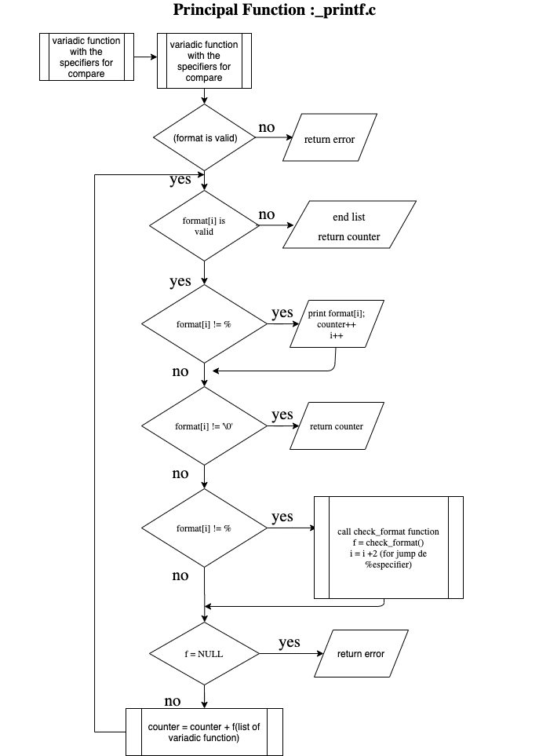
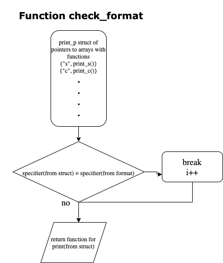

# PROJECT _PRINTF FUNCTION _printf(). Repository: printf

_printf is a function to do formatted printing. In this program we develop the function for simple printing and the format specificatrions printing. 

Depending of the content in the (), this functions use the simple printing or the use or specifiers.

In this project we made the tasks 0 - 2 of mandatory part, and the 14 advanced tasks.
The first task develop the function as such, only with the c, s and % specifiers. Then, the next task, add more specifiers.

We used a principal function called _printf() for give the string or specifiers to other function called check_format. In this second function search wich specifier is and and send it to other funtion that prints the correspondent argument.
For understand how it works we can use this flow chart.

## Usage
For useit you need all the files in the repository.

## Contributing
Pull requests are welcome. For major changes, please open an issue first to discuss what you would like to change.

Please make sure to update tests as appropriate.
